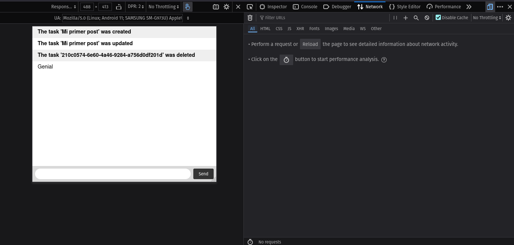

# Node Backend + Web Socket

This project is a simple, real-time task management API built with Node.js and Express. It allows users to create, list, update, and delete tasks. The application uses WebSockets (implemented with Socket.io) to notify all connected clients about changes to tasks, ensuring a real-time update without the need to refresh the page. Data persistence is handled with a SQLite3 database for a simple and lightweight configuration.

### Key Features & Technologies

- **TypeScript**: A typed superset of JavaScript that compiles to plain JavaScript.
- **Drizzle** ORM: A lightweight, TypeScript-first ORM for building modern applications.
- **SQLite3**: A C-language library that implements a small, fast, self-contained, high-reliability, full-featured, SQL database engine.
- **Socket.io**: A library that enables real-time, bidirectional, and event-based communication between the browser and the server.
- **tsx**: Enables Node.js to run TypeScript directly.
- **tsup**: A simple and powerful bundler for your TypeScript library, powered by esbuild.
- **Minimalist Structure**: A clean and well-organized file structure for efficient development.
- **Environment Variables**: Comes with a .env file for managing environment-specific configurations.

### File Structure

This is the file structure of the project

```sh
.
├── client/
│   ├── css
│   └── index.html
├── dist/
│   ├── index.d.ts
│   ├── index.d.ts.map
│   ├── index.js
│   ├── index.js.map
│   └── src
├── drizzle/
├── drizzle.config.ts
├── example.env
├── local.db
├── package.json
├── package-lock.json
├── README.md
├── src/
│   ├── controllers/
│   ├── db/
│   ├── index.ts
│   ├── models/
│   ├── routes/
│   └── services/
└── tsconfig.json
```

### Getting Started

To get a copy of this project up and running on your local machine, follow these steps.

**Prerequisites**

You will need the following software installed on your computer:

- Git
- Node.js (v20 or higher)
- npm (v10 or higher)

**Installation**

```sh
# Clone the repository:
git clone https://github.com/felipe300/node-backend.git
cd node-backend

# Install Dependencies:
npm install
```

**Usage**

Use Drizzle ORM plus SQLite3

```sh
# Genere Drizzle schema:
npx drizzle generate

# Create Database
npx drizzle push
```

The project includes several pre-configured npm scripts to help with development and building.

```sh
# Run the project in developer mode
npm run dev

# Run Oxlint
npm run lint
```

### API Endpoints

```sh
# Create Task
curl -L'http://localhost:3000/tasks' \
-H 'Content-Type: application/json' \
-d '{
    "title": "Una nueva tarea",
    "description": "Descripción de mi tarea creada con cURL."
    "status": "pendiente"
}'

# Get all Tasks
curl -L 'http://localhost:3000/tasks'

# Update a Task
curl -X PUT 'http://localhost:3000/tasks/:id' \
-H 'Content-Type: application/json' \
-d '{ "status": "completado" }'

# Delete a Task
curl -X DELETE 'http://localhost:3000/tasks/:id'
```

You can check the changes in `http://localhost:3000/`, trough WebSockets.


